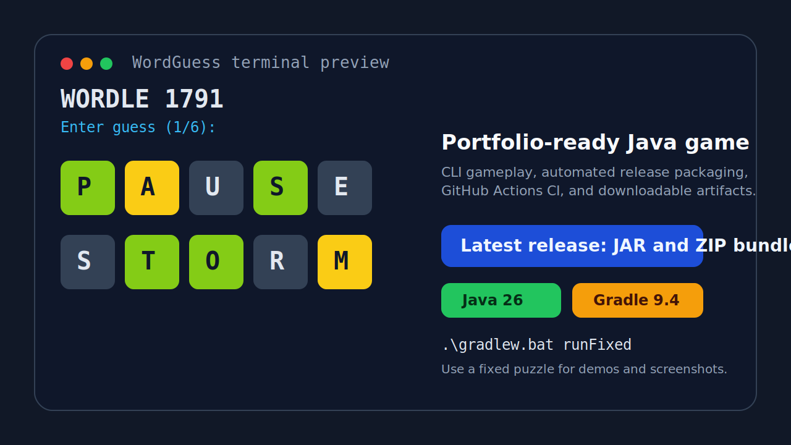

# WordGuess

[](https://github.com/frankwyf/WordGuess/actions/workflows/ci.yml)
[](https://github.com/frankwyf/WordGuess/actions/workflows/release.yml)
[](https://www.oracle.com/java/)
[](https://gradle.org/)
[](https://github.com/frankwyf/WordGuess/blob/main/LICENSE)

A terminal-based word guessing game inspired by Wordle.

This project is maintained as an open-source portfolio game.



## At a Glance

- Terminal-first Wordle-style gameplay with standard and accessibility modes.
- Java 26 + Gradle 9.4 build with automated CI and release packaging.
- Downloadable release artifacts for Windows native launch, standard Java bundles, and a runnable uber JAR.

## Features

- Daily puzzle mode and fixed puzzle mode for demos, tests, and portfolio screenshots.
- Accessibility mode with text-based positional hints instead of color-only feedback.
- Local history tracking plus simple win-rate and streak statistics.
- Release-ready packaging: Windows native bundle, zipped app distribution, and runnable uber JAR.

## Download Latest Release

- Latest release page: [github.com/frankwyf/WordGuess/releases/latest](https://github.com/frankwyf/WordGuess/releases/latest)
- Windows users: [WordGuess-windows.zip](https://github.com/frankwyf/WordGuess/releases/latest/download/WordGuess-windows.zip)
- After extracting `WordGuess-windows.zip`, launch `WordGuess.exe`
- Direct download, uber JAR: [wordguess-all.jar](https://github.com/frankwyf/WordGuess/releases/latest/download/wordguess-all.jar)
- Direct download, app bundle: [wordguess.zip](https://github.com/frankwyf/WordGuess/releases/latest/download/wordguess.zip)

## Try It

Run from source:

```powershell
.\gradlew.bat run
```

Run a fixed puzzle for demos:

```powershell
.\gradlew.bat runFixed
```

Run the packaged JAR:

```powershell
java -jar .\build\libs\wordguess-all.jar 12
```

Windows double-click option:

- Download `WordGuess-windows.zip`
- Extract it
- Double-click `WordGuess.exe`

## Terminal Session

Real output captured from `runFixedAccesbility` with the fixed puzzle:

```text
Running with accessibility model, the target word is specified in second command line argument
(Target word for Game 236 is PAUSE)

----------------------------------------------------------------
WORDLE 236
Enter guess (1/6): spare
1st, 2nd and 3rd correct but in wrong place; 5th perfect; 4th wrong.
Enter guess (2/6): pause
1st, 2nd, 3rd, 4th, 5th perfect.
You won!
```

## Language Docs

- Chinese (Simplified): [docs/README.zh-CN.md](docs/README.zh-CN.md)
- Japanese: [docs/README.ja.md](docs/README.ja.md)
- English: [docs/README.en.md](docs/README.en.md)

## Quick Start

### Requirements

- JDK 26
- Gradle Wrapper (`gradlew` / `gradlew.bat` included in repository)

The wrapper is configured to Gradle 9.4.0, which supports running on Java 26.

### Configure Java (Windows PowerShell)

```powershell
$env:JAVA_HOME='C:\Program Files\Java\jdk-26.0.1'
$env:Path="$env:JAVA_HOME\bin;$env:Path"
java -version
```

### Build and Test

```powershell
.\gradlew.bat clean test
```

### Run the Game

```powershell
.\gradlew.bat run
```

Run fixed game number (helpful for demo/testing):

```powershell
.\gradlew.bat runFixed
```

Run accessibility mode:

```powershell
.\gradlew.bat runAccesbility
```

### Package for Release

Build all release artifacts (standard distributions + runnable uber JAR):

```powershell
.\gradlew.bat packageApp
```

For a versioned public release, push a Git tag such as `v0.1.0`. GitHub Actions will build release artifacts and attach them to the GitHub Release automatically.

Artifacts:

- Windows native bundle (recommended for Windows): `build/native/windows/WordGuess-windows.zip`
- Standard app bundle (recommended): `build/distributions/wordguess.zip`
- Self-contained JAR: `build/libs/wordguess-all.jar`

Run packaged JAR on Java 26:

```powershell
$env:JAVA_HOME='C:\Program Files\Java\jdk-26.0.1'
$env:Path="$env:JAVA_HOME\bin;$env:Path"
java -jar .\build\libs\wordguess-all.jar 12
```

## Open Source

- Contribution guide: [CONTRIBUTING.md](CONTRIBUTING.md)
- License: [LICENSE](LICENSE)
- Security policy: [SECURITY.md](SECURITY.md)
- Code of conduct: [CODE_OF_CONDUCT.md](CODE_OF_CONDUCT.md)
- Changelog: [CHANGELOG.md](CHANGELOG.md)
- Release guide: [RELEASE.md](RELEASE.md)
- First release draft: [docs/releases/v0.1.0.md](docs/releases/v0.1.0.md)
- GitHub topics and labels: [GITHUB_TOPICS.md](GITHUB_TOPICS.md)

## Automation

- CI workflow: `.github/workflows/ci.yml`
- Release workflow: `.github/workflows/release.yml`
- Dependency updates: `.github/dependabot.yml`

The CI workflow runs build, tests, and packaging on pushes and pull requests. The release workflow publishes packaged artifacts when a `v*` tag is pushed.

## Project Structure

- Source code: `src/main`
- Unit tests: `src/test`
- Word data: `data/words.txt`
- GitHub automation: `.github/workflows`
